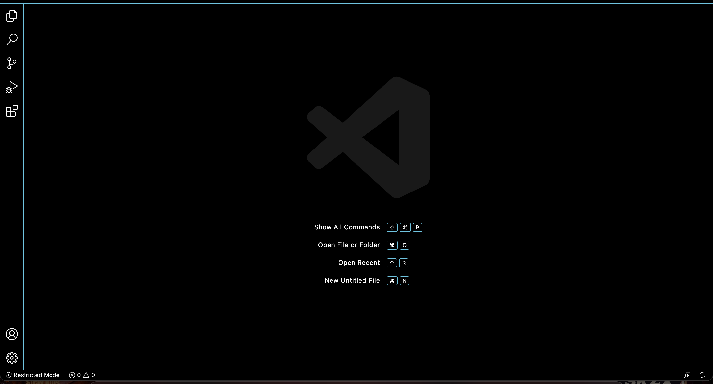
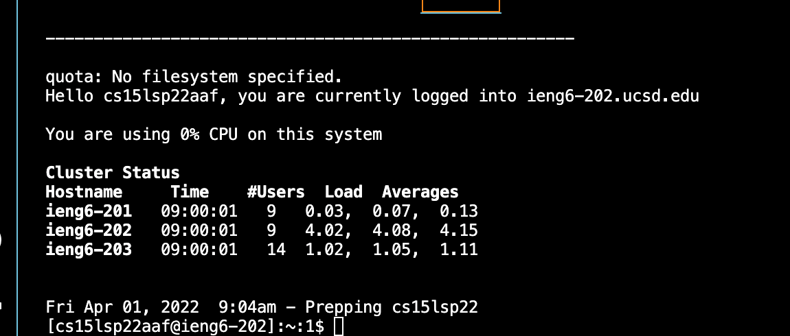
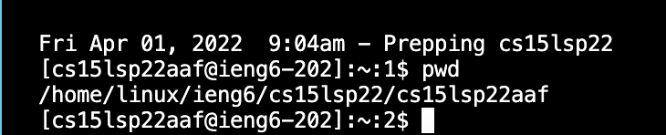
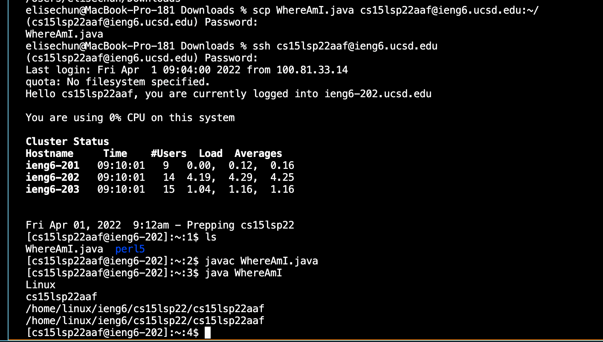
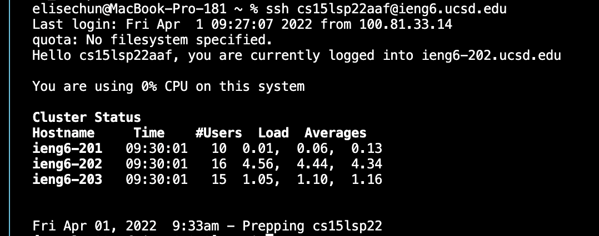
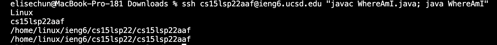

# **Logging into a course-specific account on ieng6**
created by Elise Chun

---
## **Step 1: Installing Visual Studio Code**

First, go to the Visual Studio Code website (https://code.visualstudio.com/). Download and install it on your computer. Onnce it is installed, you should be able to a window that looks like this:

Next, we will try to use our computer to connect to a remote one over the Internet.

## **Step 2: Remotely Connecting**

First, open a terminal (or Terminal &rarr; New Terminal). Type in the following command, but with the **aaf** replaced with the letters in your course-specific account:

**$ ssh cs15lsp22aaf@ieng6.ucsd.edu**

If you get a message asking if you want to continue connecting, type **yes** and press enter. Enter your password. Once you do, you should see a page that looks like this:

## **Step 3: Trying Some Commands**

Try running commands like **cd**, **ls**, **pwd**, **mkdir**, and **cp** on your computer *and* the remote computer. Here is an example of the command **pwd** being run:

This command prints the working directory.

## **Step 4: Moving Files with *scp***

Create a file on your computer called **WhereAmI.java** and paste the following contents into it:

    class WhereAmI {
  
        public static void main(String[] args) {

        System.out.println(System.getProperty("os.name"));
        System.out.println(System.getProperty("user.name"));
        System.out.println(System.getProperty("user.home"));
        System.out.println(System.getProperty("user.dir"));

        }
    }

Run it using **javac** and **java** on your computer. Then, in the terminal, run this command:

**$ scp WhereAmI.java cs15lsp22aaf@ieng6.ucsd.edu:~/**

Enter your password and log into ieng6. Use **ls** and check if the file is in your home directory. Now run it on the remote computer using **javac** and **java**. Here is a screenshot of what this process looks like:

## **Step 5: Setting an SSH Key**

Run the following to set up an **ssh** key:

    on client (your computer)

    $ ssh-keygen
    Generating public/private rsa key pair.
    Enter file in which to save the key 
    (/Users/<user-name>/.ssh/id_rsa): /Users/<user-name>/.ssh/id_rsa
    Enter passphrase (empty for no passphrase):

Do **not** enter a passphrase.

    Enter same passphrase again: 
    Your identification has been saved in /Users/<user-name>/.ssh/id_rsa.
    Your public key has been saved in /Users/<user-name>/.ssh/id_rsa.pub.
    The key fingerprint is:
    SHA256:jZaZH6fI8E2I1D35hnvGeBePQ4ELOf2Ge+G0XknoXp0 <user-name>@<system>.local
    The key's randomart image is:
    +---[RSA 3072]----+
    |                 |
    |       . . + .   |
    |      . . B o .  |
    |     . . B * +.. |
    |      o S = *.B. |
    |       = = O.*.*+|
    |        + * *.BE+|
    |           +.+.o |
    |             ..  |
    +----[SHA256]-----+

Now we'll copy the public key to the **.ssh** directory of your user account on the server.

    $ ssh cs15lsp22zz@ieng6.ucsd.edu
    <Enter Password>
    # now on server
    $ mkdir .ssh
    $ <logout>
    # back on client
    $ scp /Users/<user-name>/.ssh/id_rsa.pub cs15lsp22zz@ieng6.ucsd.edu:~/.ssh/authorized_keys
    # You use your username and the path you saw in the command above

Now we can **ssh** and **scp** without having to enter a password!

## **Step 6: Optimizing Remote Running**

In this step, we'll use some shortcuts to make a local edit to WhereAmI.java and run it on the remote computer in as little keystrokes as possible. I made use of the shortcut that puts **" "** at the end of an **ssh** command to run a file on the remote server then exit.

