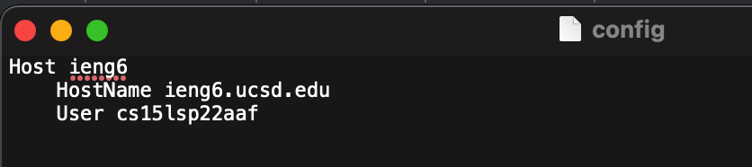
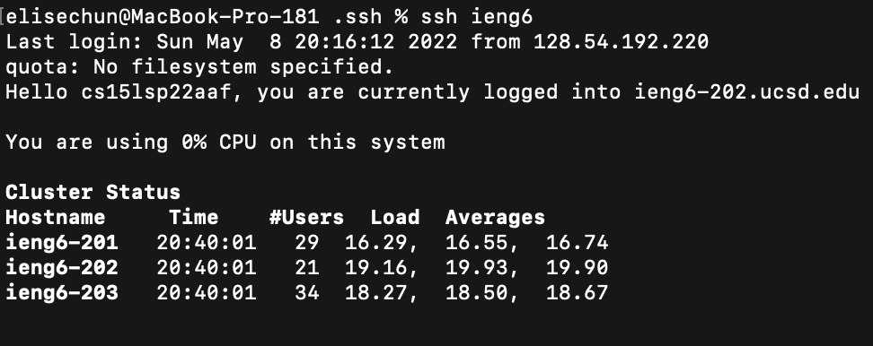
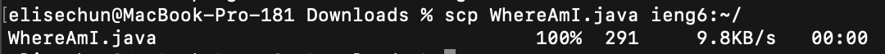
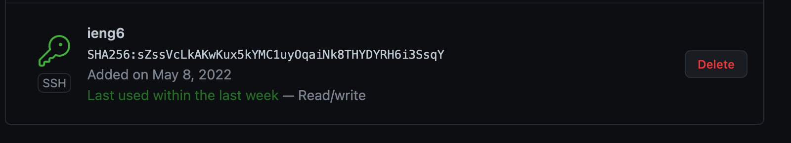
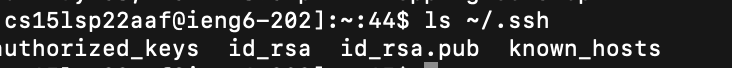
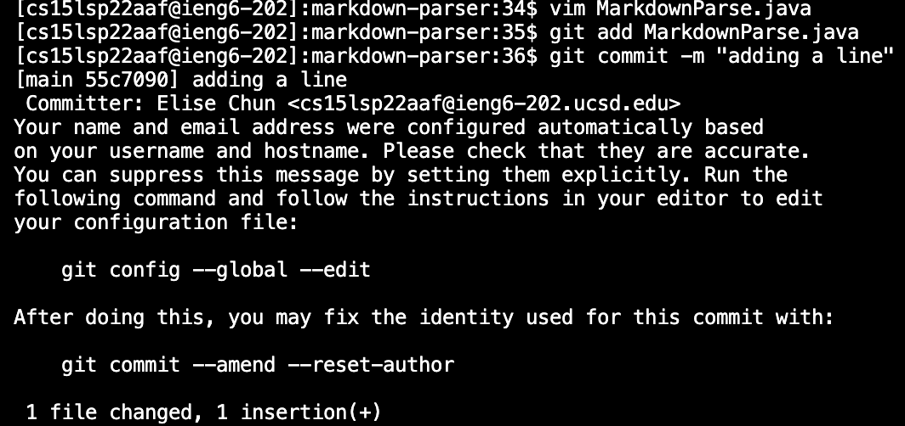
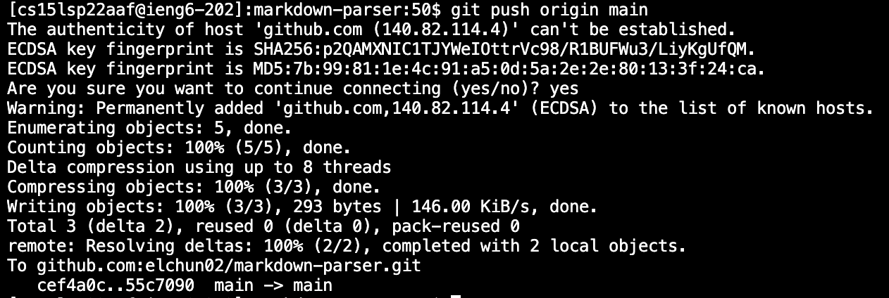
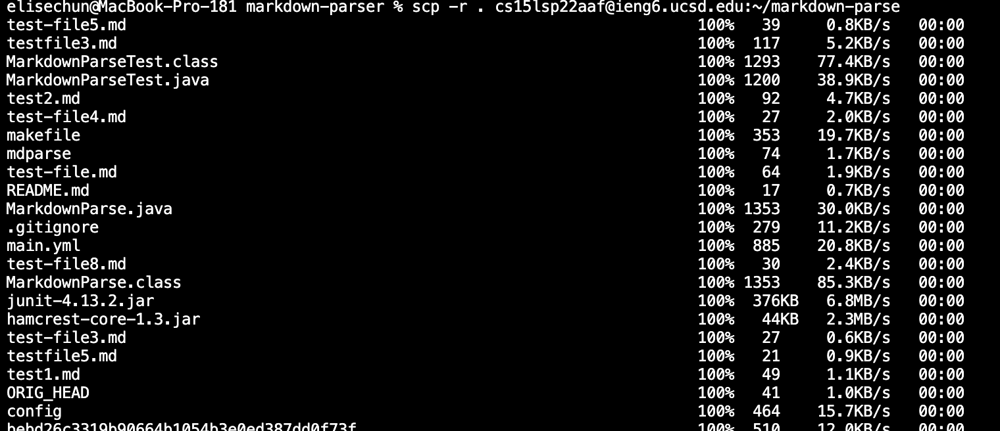
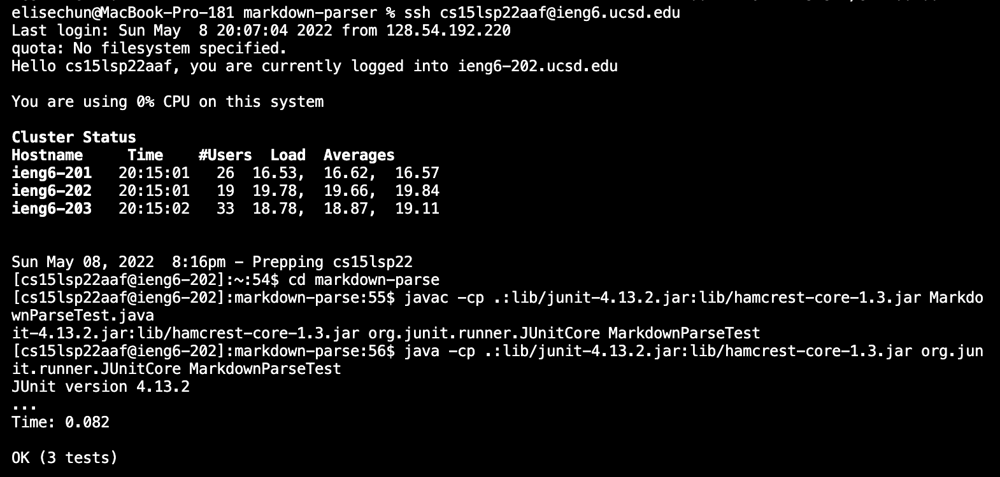
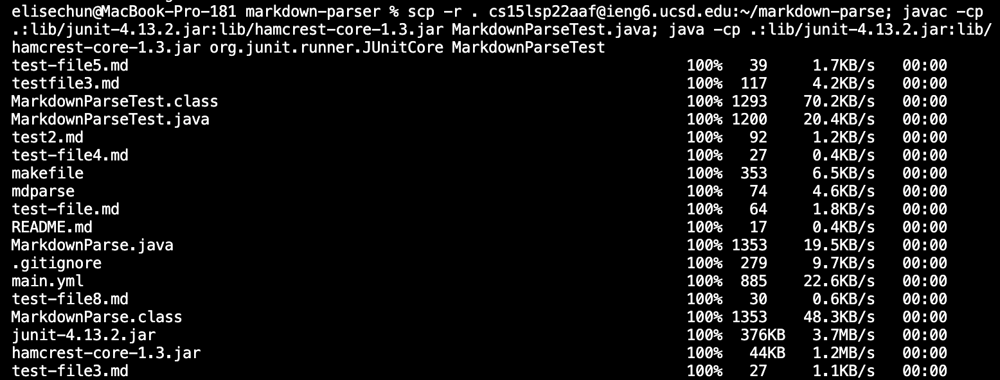

# **Lab Report 3**
created by Elise Chun

---
## **Streamlining ssh Configuration**

Streamlining ssh configuration simplifies the process of logging in by cutting how much you have to type. You tell ssh what specific username to use when logging into a corresponding server. You can also personalize or differentiate servers by giving them nicknames. 

## **Setup Github Access from ieng6**

[Link to the commit](https://github.com/elchun02/markdown-parser/commit/70679264bcbe9fe8e074072bf9b01c53b22fb16d)

Setting up access to GitHub from the remote server allows us to commit and push from the remote computer. You can do this by generating public and private keys on the remote computer and copying the public key to GitHub. The process of editing and updating files on the remote server with GitHub much simpler.

## **Copy whole directories with *scp -r***

Using *scp -r* to copy whole directories is very helpful because it prevents us from having to make a directory on the remote server and copying every file over. *scp -r* copies recursively, allowing it to copy a directory and everything inside it. With *scp -r*, copying large directories can be completed with just a one-line command.