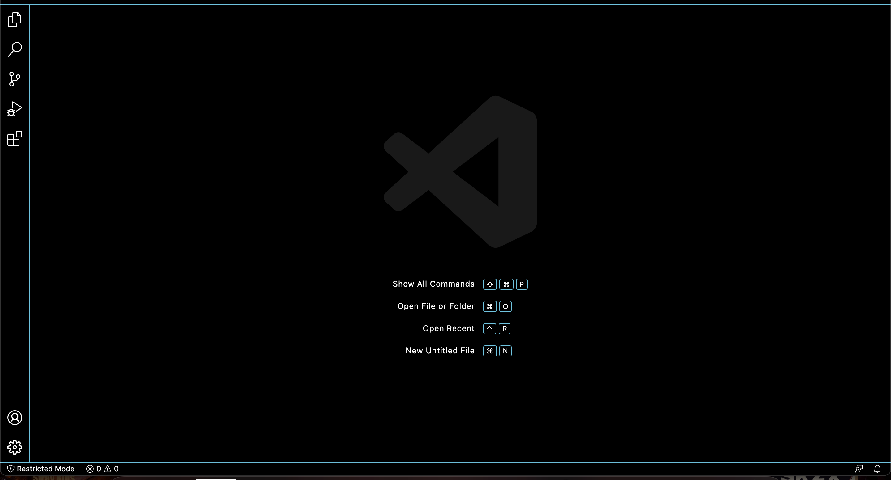

# **Logging into a course-specific account on ieng6**
created by Elise Chun

---
## **Step 1: Installing Visual Studio Code**

First, go to the Visual Studio Code website (https://code.visualstudio.com/). Download and install it on your computer. Onnce it is installed, you should be able to a window that looks like this:

Next, we will try to use our computer to connect to a remote one over the Internet.

## **Step 2: Remotely Connecting**

We are going to use VSCode's remote option to connect to the remote computer. First, open a terminal (Ctrl + ' or Terminal &rarr; New Terminal). Type in the following command, but with the **aaf** replaced with the letters in your course-specific account:

**$ ssh cs15lsp22aaf@ieng6.ucsd.edu**

If you get a message asking if you want to continue connecting, type **yes** and press enter. Go ahead and enter your password. Once you do, you should see a page that looks like this:

