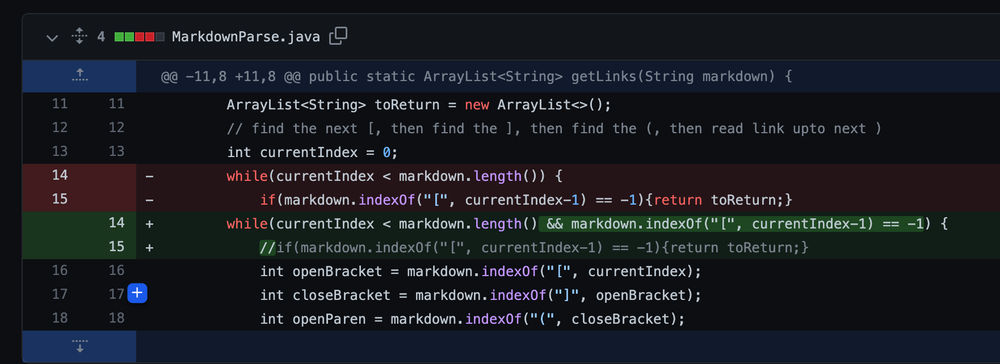
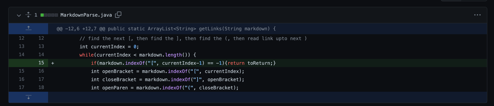
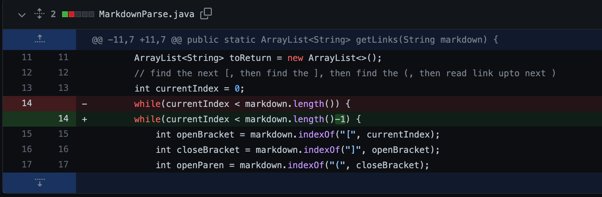

# **Bugs, Symptoms, Failure-Inducing Inputs**
by Elise Chun

---
## **Code Change #1:**

[Failure-inducing input](https://github.com/elchun02/markdown-parser/blob/e00ba29e6510e2c7cc9e28d17680e0a8110d5a3f/test.md)

Symptom of failure-inducing input:

The failure-inducing input caused an infinite while loop because of the extra line. The bug associated with this was the code's inability to stop at the last index of the links.

## **Code Change #2:**

[Failure-inducing input](https://github.com/elchun02/markdown-parser/blob/85f5f75ac57e7d592db102b02995bfa237dce784/testfile4.md)

Symptom of failure-inducing input:

The failure-inducing input caused the code to return the incorrect output, which was an empty list. The bug associated with this was the conditions of the while loop, as the second statement seemed to prevent it from properly finding the links.

## **Code Change #3:**

[Failure-inducing input](https://github.com/elchun02/markdown-parser/blob/25be96d71751c6303d90932cbb8de8a3493fb9e7/test2.md)

Symptom of failure-inducing input:

The failure-inducing input caused an infinite while loop because there was extra space after the links. The bug associated with this was the code's inability to stop at the last index of the links when there was extra space after.