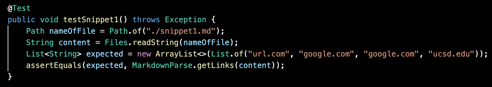
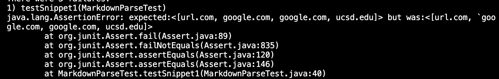
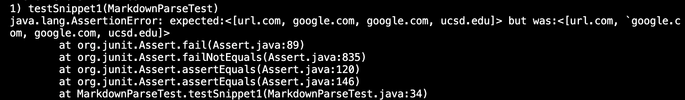
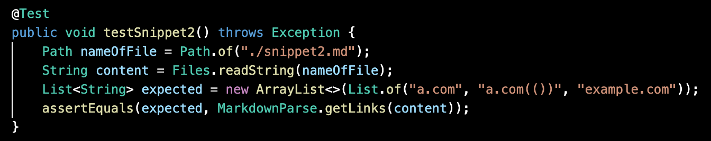
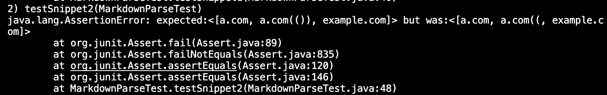
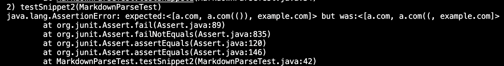
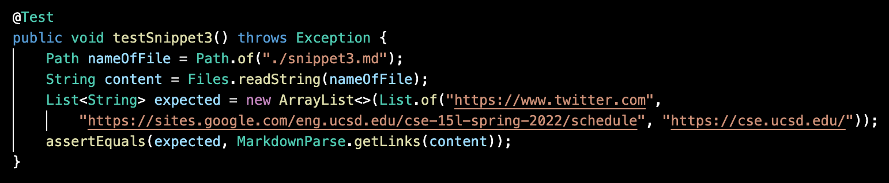
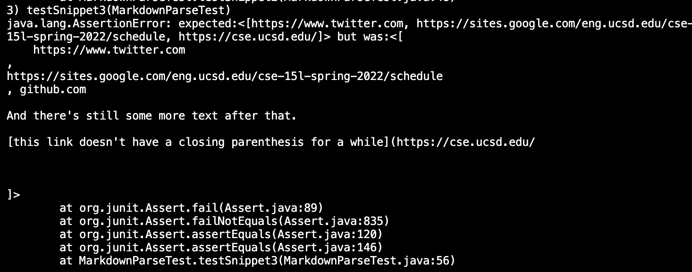
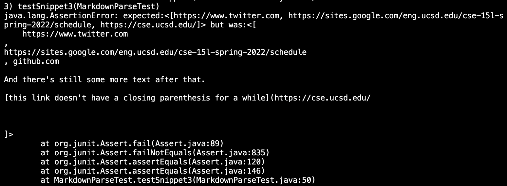

# **Lab Report 4**
created by Elise Chun

---
[Link to my markdown-parse repository](https://github.com/elchun02/markdown-parser)

[Link to reviewed markdown-parse repository](https://github.com/michellem8/markdown-parser)

## **Test Snippet 1**
Expected output: <[url.com, google.com, google.com, ucsd.edu]>

Running on my implementation:

Running on reviewed implementation:

I think I could make a small code change that would work with Snippet 1 and other similar cases. I could add an if statement concerning inline code with backticks to ignore them or deal with them a different way.

## **Test Snippet 2**
Expected output: <[a.com, a.com(()), example.com]>

Running on my implementation:

Running on reviewed implementation:

I think a small code change that would work with Snippet 2 and other similar cases may be possible, but it could require more code. I'm not entirely sure how, but I could use an if statement or add new variable(s) that deal with nested parentheses. Maybe a helper method could also fix it.

## **Test Snippet 3**
Expected output: <[https://www.twitter.com, https://sites.google.com/eng.ucsd.edu/cse-15l-spring-2022/schedule, https://cse.ucsd.edu/]>

Running on my implementation:

Running on reviewed implementation:

I think I could make a small code change that would work with Snippet 3 and other similar cases, but it may require more code. I could add an if statement concerning parentheses left open, as well as one concerning extra lines in parentheses/brackets. 