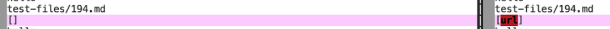
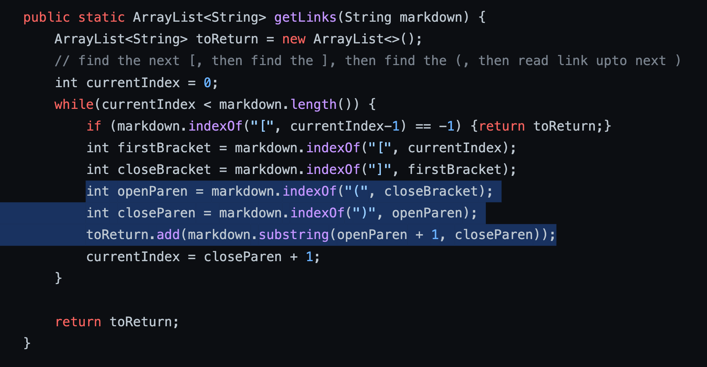
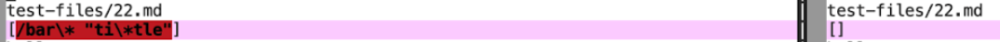
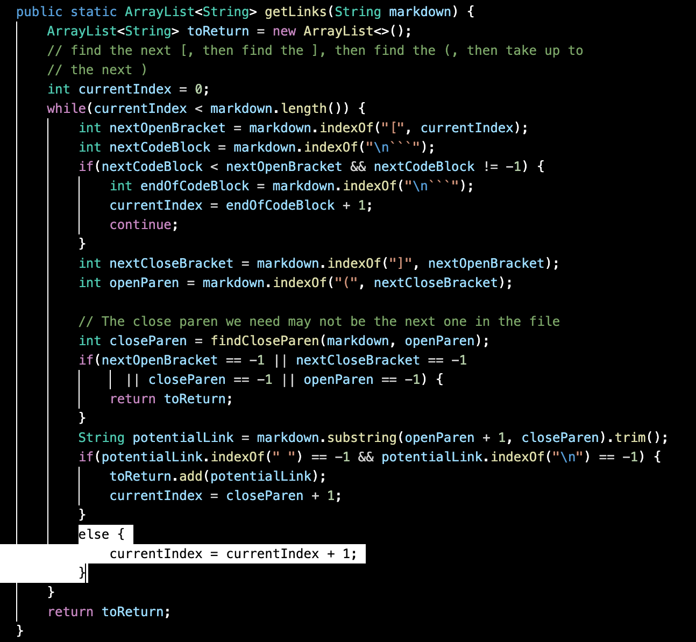

# **Lab Report 5**
created by Elise Chun

---
We found the tests with different results using **vimdiff** on the results of running a bash for loop. 

[Link to test-files/194.md]()

[Link to test-files/22.md]()

## **test-files/194.md**
Both our implementation and the provided implementation produced the incorrect output.

The output produced by each implementation:

The expected output is **[my_(url) 'title (with parens)]**.

The bug in our implementation is the incorrect determining of what a valid link is. Currently, a valid link is only one that is in between two parentheses with no other exceptions. If the determining of a valid link was expanded, the correct output could be produced.

## **test-files/22.md**
Our implementation produced the correct output, while the provided implementation produced the incorrect output.

The output produced by each implementation:

The expected output is **[/bar\* "ti\*tle"]**.

The bug in the provided implementation is its inability to return a link when there is only one of them. Currently, the code checks if there are multiple links with more if statements but does not account for when there is only one link. Since the while loop continues when it shouldn't, an empty list is returned because nextOpenBracket equals -1.

